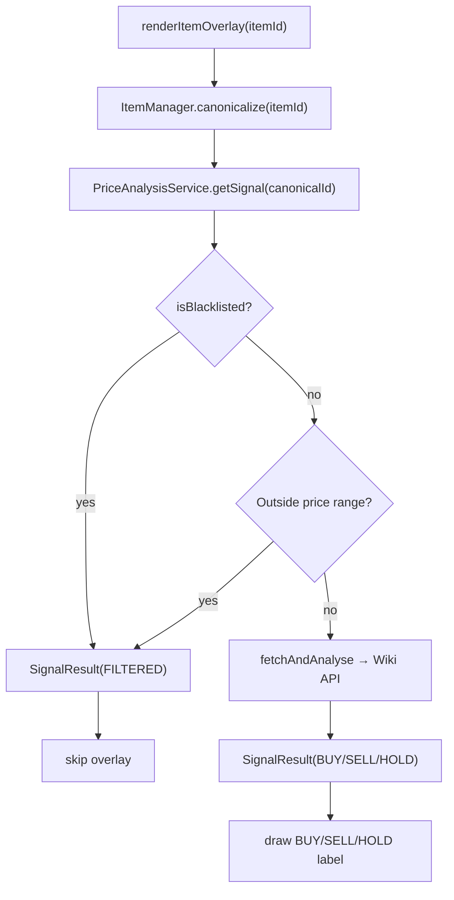

# Item Blacklist Feature

## Instructions for the Implementing LLM

You are being handed a fully researched implementation plan for a RuneLite plugin written in Java. The workspace root is `/Users/csauley/repos/buySellIndicatorRunelitePlugin`. All file paths below are relative to that root. Read each file before editing it. Make only the changes described — do not refactor unrelated code. Follow the existing code style: Allman brace style, 4-space indentation, no trailing comments that just narrate what the code does.

The four todos in this plan map to exactly four focused edits across three files. Complete them in order.

---

## Overview

Allow users to type item names (comma-separated) into a config text field. Blacklisted items are silently skipped — no overlay drawn, no bank filter match, no "View Graph" menu option — exactly like a price-`FILTERED` item.

---

## Project Context

- **Language / Build**: Java 11, Gradle, RuneLite external plugin
- **Config system**: RuneLite `@ConfigGroup` / `@ConfigItem` annotations on an interface. RuneLite auto-generates the UI panel from these annotations. A `String` config item renders as a plain text input field.
- **Item identification**: Items are identified by a canonical integer ID (`ItemManager.canonicalize(itemId)`). Item names are retrieved via `itemManager.getItemComposition(canonicalId).getName()`.
- **FILTERED signal**: `Signal.FILTERED` is already defined in `src/main/java/com/buysell/model/Signal.java`. When `PriceAnalysisService` puts a `SignalResult(Signal.FILTERED, ...)` into its cache for an item, every downstream consumer (overlay, bank filter, "View Graph" menu) already skips that item — no changes needed to those classes.
- **Cache**: `PriceAnalysisService` holds a `ConcurrentHashMap<Integer, SignalResult> cache`. Calling `clearCache()` forces all items to be re-evaluated on next render tick.

---

## Key Files

- `src/main/java/com/buysell/BuySellIndicatorConfig.java` — RuneLite config interface
- `src/main/java/com/buysell/PriceAnalysisService.java` — fetches Wiki API prices and stores `SignalResult` in cache; currently injected with `OkHttpClient` and `BuySellIndicatorConfig`
- `src/main/java/com/buysell/BuySellIndicatorPlugin.java` — main plugin; handles `onConfigChanged` to clear cache on relevant setting changes
- `src/main/java/com/buysell/BuySellIndicatorOverlay.java` — **no changes needed**
- `src/main/java/com/buysell/BankFilterManager.java` — **no changes needed**

---

## Detailed Implementation

### Todo 1 — Add `blacklistedItems` config field

**File**: `src/main/java/com/buysell/BuySellIndicatorConfig.java`

After the existing `enableBankSignalFilter()` method (currently at position 8), add the following new config item at position 9:

```java
@ConfigItem(
    keyName = "blacklistedItems",
    name = "Blacklisted Items",
    description = "Comma-separated list of item names to hide signals for (e.g. Coins, Rune essence).",
    position = 9
)
default String blacklistedItems()
{
    return "";
}
```

No other changes to this file.

---

### Todo 2 — Inject `ItemManager` into `PriceAnalysisService`

**File**: `src/main/java/com/buysell/PriceAnalysisService.java`

`PriceAnalysisService` currently has this constructor (around line 87):

```java
@Inject
public PriceAnalysisService(OkHttpClient httpClient, BuySellIndicatorConfig config)
{
    this.httpClient = httpClient;
    this.config = config;
}
```

And these two existing fields:

```java
private final OkHttpClient httpClient;
private final BuySellIndicatorConfig config;
```

Add `ItemManager` as a third injected dependency:

1. Add the import: `import net.runelite.client.game.ItemManager;`
2. Add a new private final field: `private final ItemManager itemManager;`
3. Update the constructor signature and body to accept and assign it:

```java
@Inject
public PriceAnalysisService(OkHttpClient httpClient, BuySellIndicatorConfig config, ItemManager itemManager)
{
    this.httpClient = httpClient;
    this.config = config;
    this.itemManager = itemManager;
}
```

Guice (RuneLite's DI framework) will automatically provide the `ItemManager` instance — no module changes are needed.

---

### Todo 3 — Add `isBlacklisted()` and integrate into `getSignal()` and `fetchAndAnalyse()`

**File**: `src/main/java/com/buysell/PriceAnalysisService.java`

**Step A** — Add the helper method anywhere in the class body (e.g. after `clearCache()`):

```java
private boolean isBlacklisted(int itemId)
{
    String raw = config.blacklistedItems();
    if (raw == null || raw.trim().isEmpty())
    {
        return false;
    }
    String itemName = itemManager.getItemComposition(itemId).getName();
    if (itemName == null || itemName.isEmpty())
    {
        return false;
    }
    for (String token : raw.split(","))
    {
        if (itemName.equalsIgnoreCase(token.trim()))
        {
            return true;
        }
    }
    return false;
}
```

**Step B** — Guard `getSignal()` so blacklisted items are immediately cached as `FILTERED` without triggering a network fetch.

The current `getSignal` method (starting at line 93) begins:

```java
public SignalResult getSignal(int itemId)
{
    SignalResult cached = cache.get(itemId);
    long ttlMs = (long) config.cacheMinutes() * 60_000L;
    long now = System.currentTimeMillis();

    if (cached != null && (now - cached.getComputedAtMs()) < ttlMs)
    {
```

Insert a blacklist check **before** the existing cache lookup:

```java
public SignalResult getSignal(int itemId)
{
    if (isBlacklisted(itemId))
    {
        SignalResult filtered = new SignalResult(Signal.FILTERED, 0.0, System.currentTimeMillis());
        cache.put(itemId, filtered);
        return filtered;
    }

    SignalResult cached = cache.get(itemId);
    // ... rest of method unchanged
```

**Step C** — Guard `fetchAndAnalyse()` so that even if an item slips through to the background thread, it is still caught. The method currently starts with:

```java
private void fetchAndAnalyse(int itemId)
{
    try
    {
        List<Candle> candles = fetchTimeseries(itemId);
        SignalResult result;
        BuySellIndicatorConfig.AnalysisBundle bundle = config.analysisBundle();
        int minCandles = minCandlesRequired(bundle);
```

Insert the blacklist check as the very first thing inside the `try` block:

```java
private void fetchAndAnalyse(int itemId)
{
    try
    {
        if (isBlacklisted(itemId))
        {
            log.debug("fetchAndAnalyse skipping blacklisted item {}", itemId);
            cache.put(itemId, new SignalResult(Signal.FILTERED, 0.0, System.currentTimeMillis()));
            return;
        }

        List<Candle> candles = fetchTimeseries(itemId);
        // ... rest of method unchanged
```

---

### Todo 4 — Clear cache on blacklist config change

**File**: `src/main/java/com/buysell/BuySellIndicatorPlugin.java`

The existing `onConfigChanged` method already clears cache for `analysisBundle`, `minItemPrice`, and `maxItemPrice`. Add an equivalent block for `blacklistedItems`:

```java
if ("blacklistedItems".equals(event.getKey()))
{
    log.debug("Blacklist changed; clearing price cache");
    analysisService.clearCache();
}
```

Place this block alongside the existing cache-clearing blocks within the `onConfigChanged` method.

---

## Data Flow (after changes)



---

## Verification Checklist

After making all changes, verify:

- `BuySellIndicatorConfig.java` has a new `blacklistedItems()` method returning `""` by default, at position 9
- `PriceAnalysisService.java` imports `net.runelite.client.game.ItemManager`, has a new `itemManager` field, updated constructor, new `isBlacklisted()` method, and blacklist guards at the top of both `getSignal()` and `fetchAndAnalyse()`
- `BuySellIndicatorPlugin.java` clears the cache when `blacklistedItems` config key changes
- No changes were made to `BuySellIndicatorOverlay.java`, `BankFilterManager.java`, or any model/test files (unless fixing a compile error)
- The project compiles cleanly: `./gradlew build` (or `./gradlew compileJava` for a quick check)
